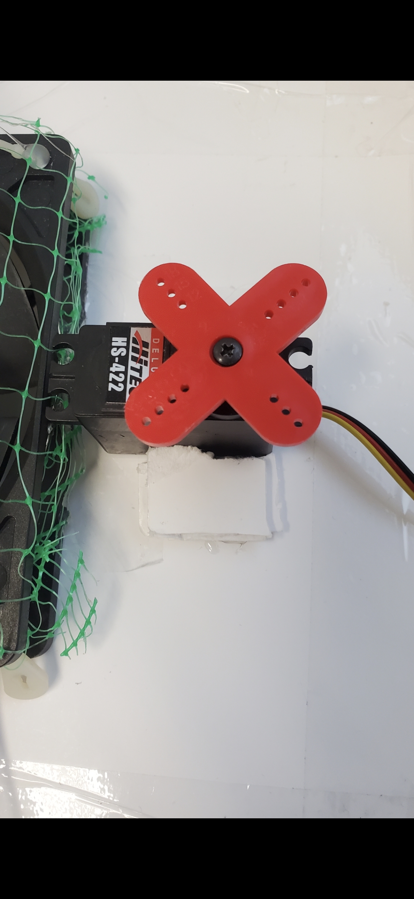
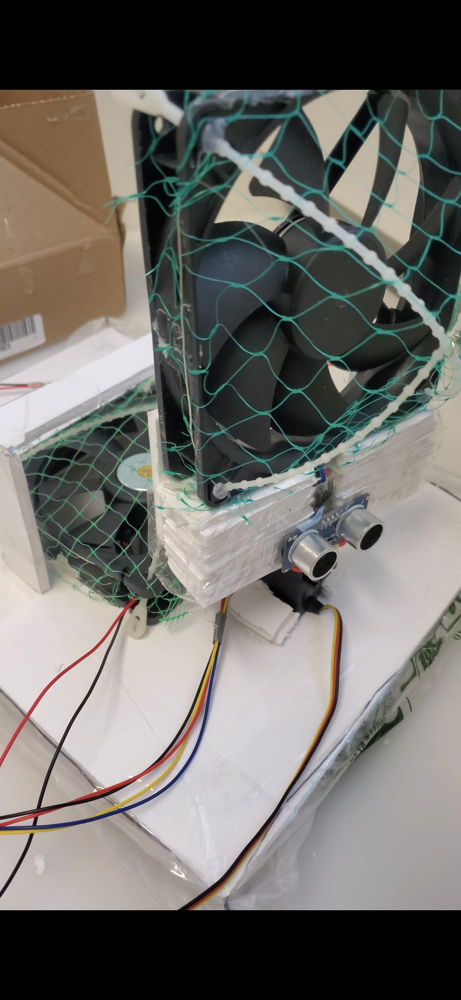
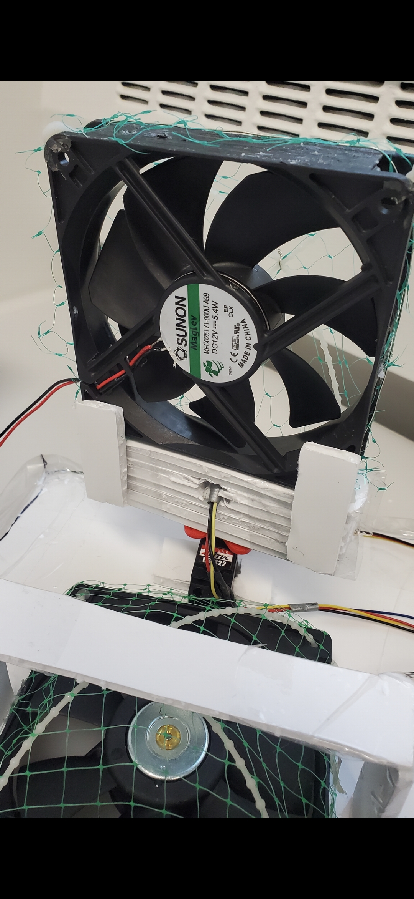

# About-Me
Hi, I'm Amine ! I'm a Third-year **Computer Engineering student at Concordia**. I love hardware as much as software, so my projects range from building ticketing websites to custom hovercrafts.

**My Team Projects:** 

Ticketing Platform: A full-stack web app for event management. [Watch the Demo 📺](https://youtu.be/JCY2xazD2kg) 
 
 
Custom Hovercraft: A deep dive into hardware and motor control. 

  
  
  

**What I've Been Building (personal projects)**:

A discord Bot for my own server (Python)
 
Various Minecraft mods for fun (Java) 
 
A Retro 2D Space shooter game (C++)
 
and more !
 
 
 
Also,
  
You can contact me at:
 
aminemefti@hotmail.com
