# About-Me
Hi, I'm Amine ! I'm a Third-year **Computer Engineering student at Concordia**. I love hardware as much as software, so my projects range from building ticketing websites to custom hovercrafts.

🌐 **[Check out my Portfolio Website here !](https://portfolio-amine-ten.vercel.app/)**

**My Team Projects:**

**SeatFinder:** End-to-end IoT system tracking study room availability using an ESP32 WROOM, HLK-LD2450 mmWave Radar, and Firebase. This 3-seat micro-zone prototype was supported by a Python simulation for optimal sensor placement.

  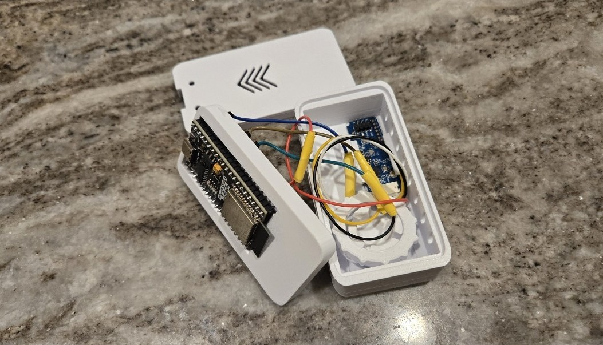
  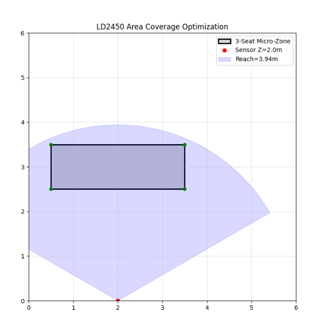
   
  ESP32 hardware enclosure (left) and Python simulation plot for sensor coverage optimization (right)

 

  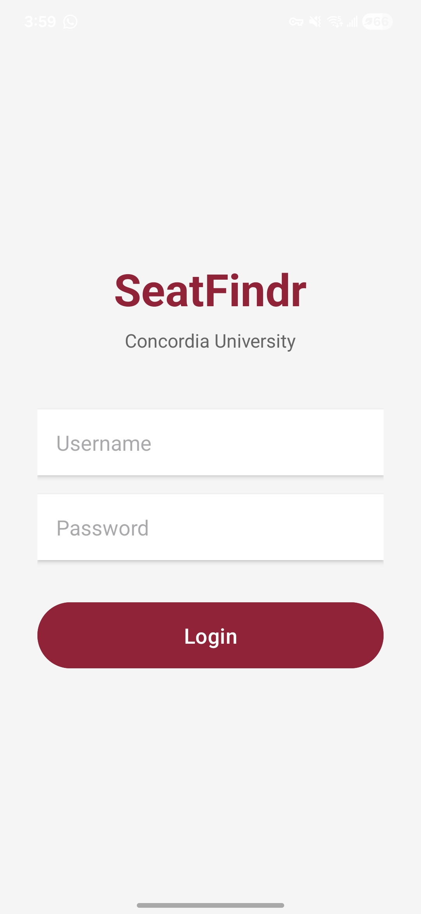
  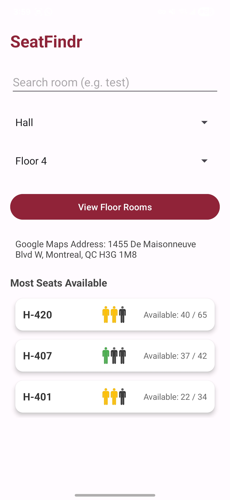
   
  Android mobile application interface (Login and Main Activity dashboards)

 

**Ticketing Platform:** A full-stack web app for event management. [Watch the Demo 📺](https://youtu.be/JCY2xazD2kg) 

**Custom Hovercraft:** A deep dive into hardware and motor control, built from scratch with custom-made parts.

  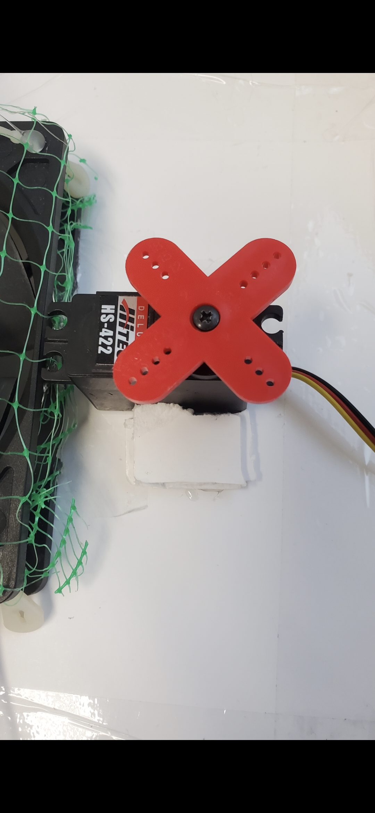
  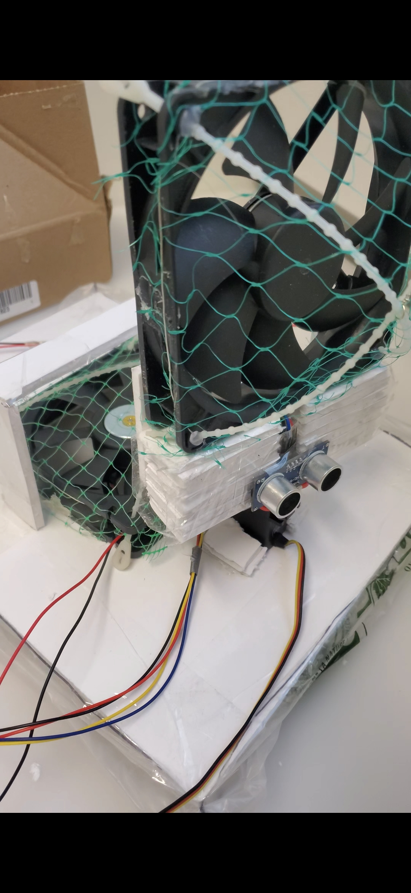
  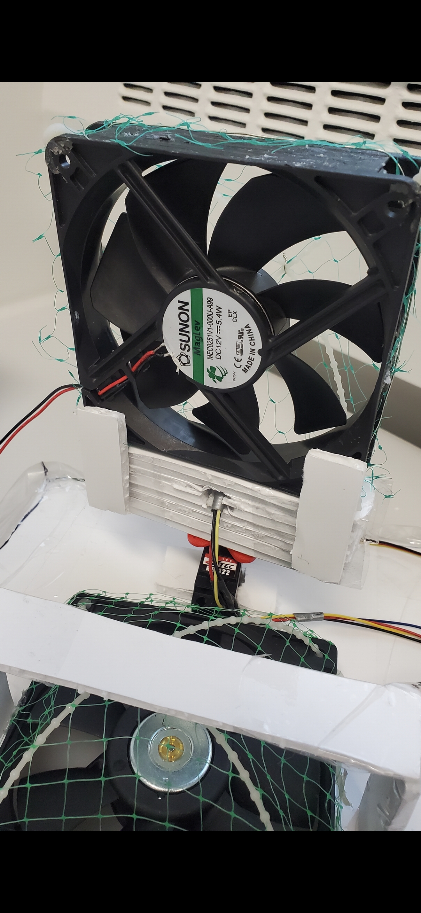

 

**What I've Been Building (personal projects):**

**TaskSplit:** An AI-driven productivity app that leverages generative AI APIs to automatically decompose complex academic assignments into manageable, trackable steps with built-in focus sessions.

  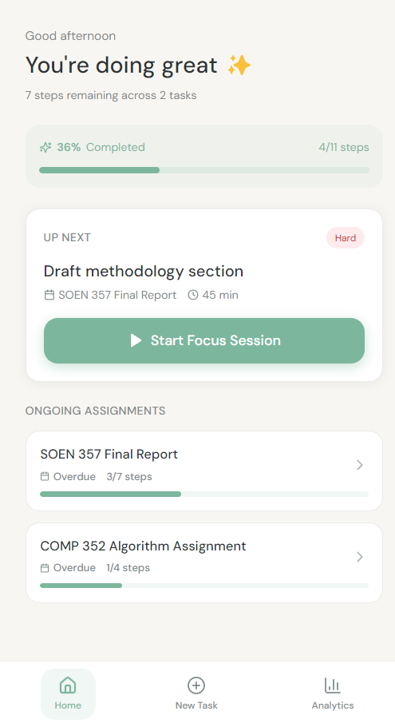
  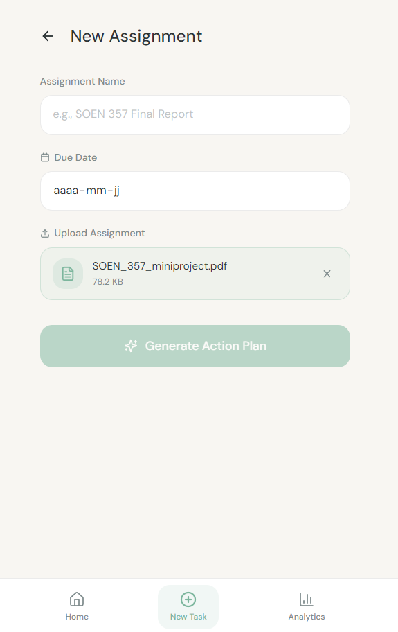
  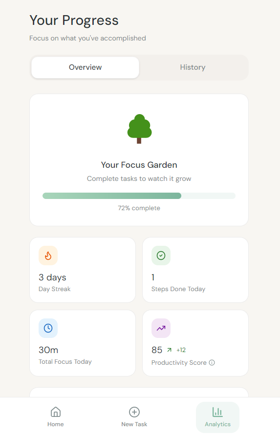
  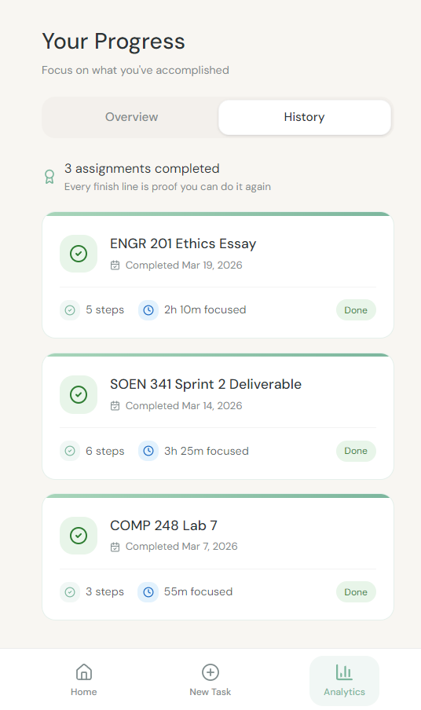
   
  TaskSplit UI screenshots: Project Dashboard (far left), 'New Assignment' view (center left), and comprehensive 'Your Progress' analytics (overview and history, right).

 

A discord Bot for my own server (Python)
 
Various Minecraft mods for fun (Java) 
 
A Retro 2D Space shooter game (C++)
 
and more !
 
 

**Let's Connect:**
  
Portfolio: [portfolio-amine-ten.vercel.app](https://portfolio-amine-ten.vercel.app/)
 
Email: aminemefti@hotmail.com
